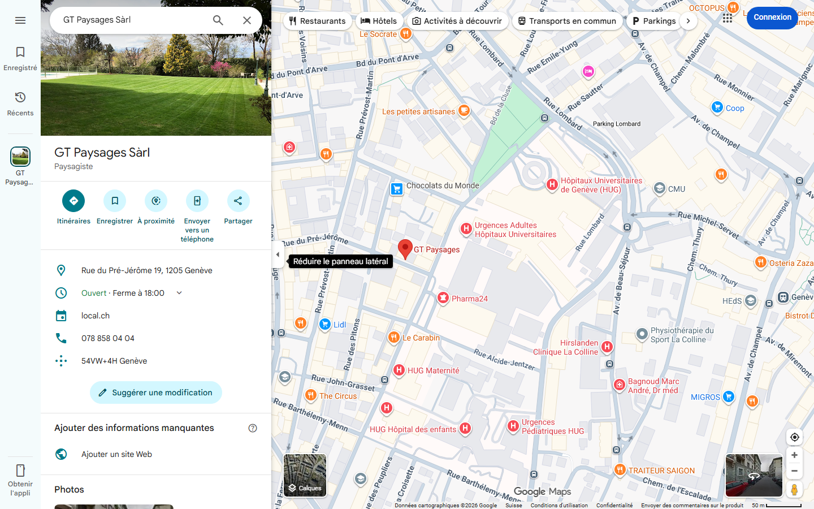
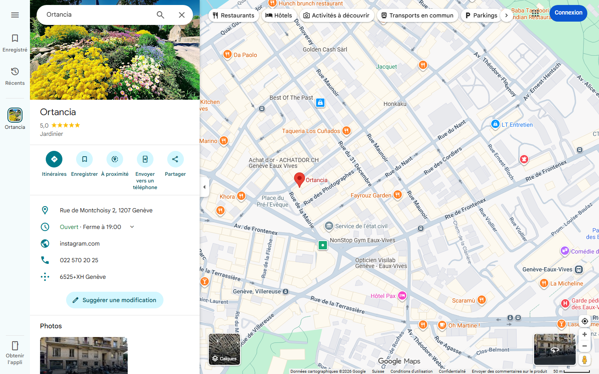
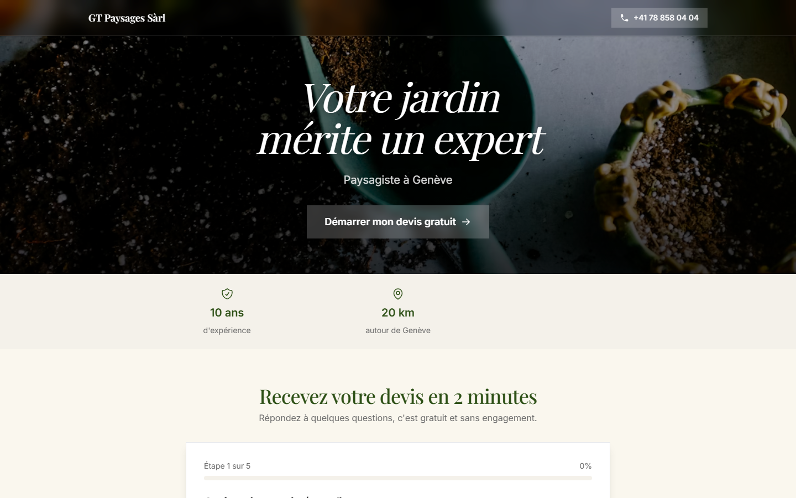

# Audit Présence Google pour GT Paysages Sàrl

> Audit et formulaire devis préparé par Jonathan le 30 avril 2026 à Genève.

---

## 1. Ta fiche Google aujourd'hui

**Verdict.** Sur _« paysagiste genève »_, tu es en position 11.

**Ortancia** capture le Top 1 avec 5/5 (30 avis Google).

---

## 2. Le coût de l'invisibilité

| Donnée                              | Valeur                     |
| ----------------------------------- | -------------------------- |
| Volume Google « paysagiste genève » | **140 recherches / mois**  |
| Cluster local (toutes variantes)    | 310 recherches / mois      |
| Part Top 3 Maps (40-55 % des clics) | 41 à 57 visiteurs / mois   |
| Contacts qualifiés possibles        | 3 à 7 demandes / mois      |
| **Manque à gagner**                 | **540 à 1'260 CHF / mois** |

> Calcul : volume × part Top 3 × taux contact × taux conversion (4 %) × ticket moyen (4500 CHF). Médianes Suisse romande 2025-2026.

---

## 3. La démo, à tes couleurs

J'ai construit ta page de devis personnalisée :
**[eg.jonlabs.ch/cadeau/gt-paysages](https://eg.jonlabs.ch/cadeau/gt-paysages)**

Essaie le quiz (on peut évidemment le personnaliser suivant tes services, tes préférences, ta zone d'intervention). Le client reçoit un aperçu du devis avec une fourchette de prix (qu'on pourra évidemment aussi adapter selon tes prix).

De ton côté, tu reçois toutes les informations du client proprement, en format PDF, directement par SMS, WhatsApp ou mail. Ça te permet de prioriser et filtrer les demandes.

---

## 4. Ce qu'on ferait ensemble

- **Top 3 Google Maps en 90 jours.** Si on n'y est pas, je continue tant que c'est pas atteint.
- Site, fiche GMB, posts, avis, leads. Clé en main.
- 2 h de ton temps total. Le reste, je gère.

[Réserver 20 min](https://cal.com/jonlabs/eg-paysagiste). C'est sur cet appel qu'on voit si ça matche.

Jonathan
contact@jonlabs.ch
